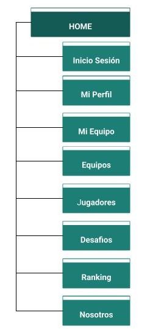
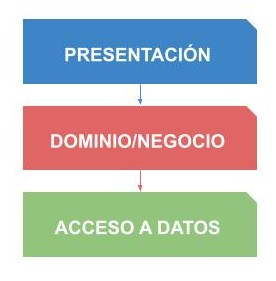

# Matchmaking Futbol 5: Plataforma de Gestión y Organización de Partidos

# Objetivo
La plataforma tiene como propósito facilitar la organización y gestión de partidos de fútbol 5 entre equipos de jugadores amateurs o semiprofesionales. Los usuarios podrán registrarse, formar equipos, organizar partidos y registrar resultados.
# Funcionalidades

## Registro y autenticacion de usuarios
Cualquier persona puede registrarse como usuario de la plataforma adquiriendo automaticamente el perfil de jugador. Con el fin de registrarse se debera tener en cuenta diversos datos del solicitante como su email, contrasena, nombre, apellido, fecha de nacimiento, entre otros.
En esta funcionalidad se debera perimitir un inicio de sesion con autenticacion segura y la posibilidad de recuperar la contrasena.

## Creacion y gestion de equipos
Al momento de crear por primera vez un equipo, el responsible adquiere el rol de administrador del equipo. Ademas de los datos obligatorios, esta funcionalidad tendra integrado una API de Google Maps para indicar y guardar la localizacion referencial del equipo.
Como parte de la gestion, el referente podra buscar un jugador y luego enviarle una solicitud de adhesion, la cual puede ser aceptada o rechazada. Ademas, podra desvincular un jugador de su propio equipo.

## Creacion y gestion de desafios
El referente de cada equipo tiene la posibilidad de encontrar mediante una busqueda avanzada a diferentes equipos para enviar un solicitud de desafio, la cual puede ser aceptada, rechazada o cancelada solo por el referente contrario. En el caso de una solicitud aceptada, los responsables pueden coordinar los detalles del partido a disputar mediante la aplicacion de Whatsapp. Ademas, una solicitud aceptada  podra ser cancelada por cualquiera de los dos equipos en cuestion.

## Coordinacion y registro de resultados
Una vez finalizado un partido, cada referente puede cargar y visualizar un formulario con los resultados (goles, asistencias, tarjetas amarillas y rojas) de su equipo y el contrincante. Si ambos confirman los resultados entonces tendran la siguiente opcion de registrar su resultado a nivel de equipo y jugadores como asi tambien calificar al adversario teniendo en cuenta el partido ya disputado. 
Por otro lado, si los equipos no se ponen de acuerdo en cinco iteraciones, entonces el desafio o partido disputado se da por anulado. 

## Sistema de Ranking y Experiencia (ELO)
La plataforma web debera permitir un ranking dinamico basado en el sistema de puntuacion ELO para cada equipo y jugador teniendo en cuenta las siguientes categorias:
- Principiante
- Amateur
- Semiprofesional
- Profesional

Dicha informacion servira para findes descriptivos de cada jugador y equipo como para operaciones de busqueda.

# Roles

## Administrador de la Plataforma
Es el perfil que tiene acceso a todos los datos y secciones de la plataforma web. Además puede actualizar información que se haya reportado como incorrecta por otros usuarios y moderar comentarios y calificaciones.

## Administrador del Equipo
Es el perfil que tiene permitido las siguientes acciones:
- Enviar una invitacion a un jugador para su equipo creado.
- Desvincular un jugador que ya esta asignado a su equipo.
- Buscar y seleccionar un equipo rival para crear y enviar un desafio a dicho rival.
- Cargar y confirmar el resultado final de un partido finalizado.
- Calificar el comportamiento del equipo rival despues de un partido finalizado con la posibilidad de dejar un comentario.

## Jugador
Es el perfil que tiene todo usuario en el momento de registrarse en la plataforma. Posee las siguientes acciones:
- Visualizar su perfil teniendo en cuenta sus estadisticas personales e historial de partidos disputados.
- Visualizar el perfil de otros jugadores como el de equipos.
- Enviar o rechazar una solicitud para adherirse a un equipo.

# Sitemap de la Plataforma Web

# Wireframe

# Arquitectura de la Aplicacion
## Arquitectura Cliente/Servidor
Los clientes (web browser) se comunican con la aplicacion mediante peticiones HTTP a traves de la Internet. Dicha aplicacion se encuentra alojada en un servidor remoto junto a la base de datos y otros recursos externos.

## Arquitectura en Capas

# Diagrama
