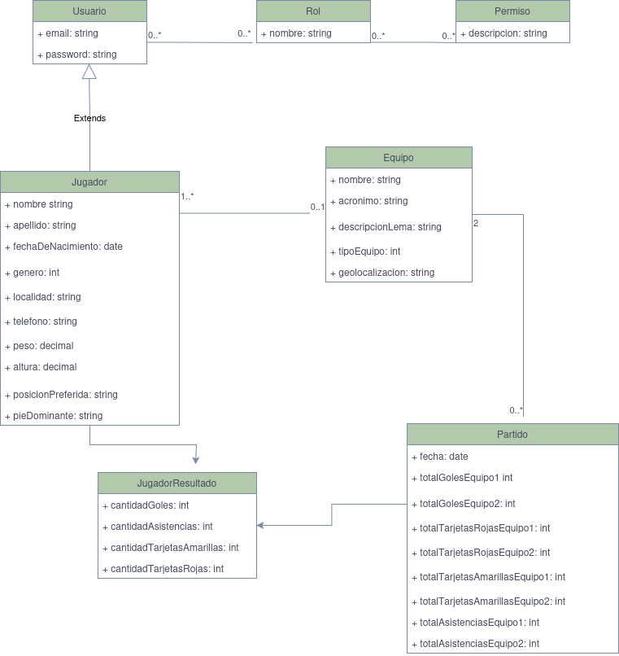

# Matchmaking Futbol 5: Plataforma de Gestión y Organización de Partidos

# Objetivo
La plataforma tiene como propósito facilitar la organización y gestión de partidos de fútbol 5 entre equipos de jugadores amateurs o semiprofesionales. Los usuarios podrán registrarse, formar equipos, organizar partidos y registrar resultados.
# Funcionalidades

## Registro y autenticación de usuarios
Cualquier persona puede registrarse como usuario de la plataforma adquiriendo automáticamente el perfil de jugador. Con el fin de registrarse se debe tener en cuenta diversos datos como el email, contrasena, nombre, apellido, fecha de nacimiento, entre otros.
En esta funcionalidad se debe perimitir un inicio de sesión con autenticación segura y la posibilidad de recuperar la contrasena.

## Creación y gestión de equipos
Al momento de crear por primera vez un equipo, el responsible adquiere el rol de administrador del equipo. Además de los datos obligatorios, esta funcionalidad tiene integrado una API de Google Maps para indicar y guardar la localización referencial del equipo.
Como parte de la gestión, el referente puede buscar un jugador y luego enviarle una solicitud de adhesión, la cual puede ser aceptada o rechazada. Ademós, puede desvincular un jugador de su propio equipo.

## Creación y gestión de desafíos
El referente de cada equipo tiene la posibilidad de encontrar mediante una búsqueda avanzada a diferentes equipos para enviar un solicitud de desafío, la cual puede ser aceptada, rechazada o cancelada solo por el referente contrario. En el caso de una solicitud aceptada, los responsables pueden coordinar los detalles del partido a disputar mediante la aplicación de Whatsapp. Además, una solicitud aceptada podrá ser cancelada por cualquiera de los dos equipos en cuestión.

## Coordinación y registro de resultados
Una vez finalizado un partido, cada referente puede cargar y visualizar un formulario con los resultados (goles, asistencias, tarjetas amarillas y rojas) de su equipo y el contrincante. Si ambos confirman los resultados entonces tendrán la siguiente opción de registrar su resultado a nivel de equipo y jugadores como así también calificar al adversario teniendo en cuenta el partido ya disputado. 
Por otro lado, si los equipos no se ponen de acuerdo en cinco iteraciones, entonces el desafío o partido disputado se da por anulado. 

## Sistema de Ranking y Experiencia (ELO)
La plataforma web debe permitir un ranking dinámico basado en el sistema de puntuación ELO para cada equipo y jugador teniendo en cuenta las siguientes categorías:
- Principiante
- Amateur
- Semiprofesional
- Profesional

Dicha información sirve para fines descriptivos de cada jugador y equipo como para operaciones de búsqueda.

# Roles

## Administrador de la Plataforma
Es el perfil que tiene acceso a todos los datos y secciones de la plataforma web. Además puede actualizar información que se haya reportado como incorrecta por otros usuarios y moderar comentarios y calificaciones.

## Administrador del Equipo
Es el perfil que tiene permitido las siguientes acciones:
- Enviar una invitacion a un jugador para su equipo creado.
- Desvincular un jugador que ya está asignado a su equipo.
- Buscar y seleccionar un equipo rival para crear y enviar un desafío a dicho rival.
- Cargar y confirmar el resultado final de un partido finalizado.
- Calificar el comportamiento del equipo rival después de un partido finalizado con la posibilidad de dejar un comentario.

## Jugador
Es el perfil que tiene todo usuario en el momento de registrarse en la plataforma. Posee las siguientes acciones:
- Visualizar su perfil teniendo en cuenta sus estadísticas personales e historial de partidos disputados.
- Visualizar el perfil de otros jugadores como el de equipos.
- Enviar o rechazar una solicitud para adherirse a un equipo.

# Sitemap de la Plataforma Web

# Wireframe
[Enlace al Figma](https://www.figma.com/design/4SNjXA2fyOQJw5l6VsIHeq/Match-Making-Futbol-5?node-id=0-1&p=f)

# Arquitectura de la Aplicacion
## Arquitectura Cliente/Servidor
Los clientes (web browser) se comunican con la aplicación mediante peticiones HTTP a través de la Internet. Dicha aplicación se encuentra alojada en un servidor remoto junto a la base de datos y otros recursos externos.

## Arquitectura en Capas
La aplicación web consta de 3 capas:
- Presentación: capa responsable  de manejar la interaz gráfica de usuario como por ejemplo las vistas renderizadas y los formularios HTML teniendo en cuenta las páginas web.
- Dominio/Negocio: capa donde se encuentran todos los modelos, sus operaciones y restricciones vinculadas a la lógica del negocio de la aplicación.
- Acceso a Datos (Persistencia): capa que tiene la responsabilidad de almacenar y obtener datos a partir de un repositorio de datos como una base datos o un archivo plano.

# Diagrama

