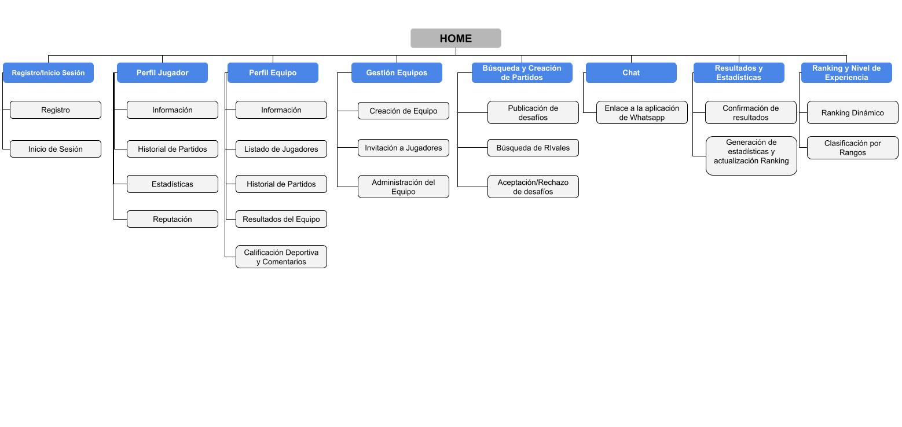

# Matchmaking Futbol 5: Plataforma de Gestión y Organización de Partidos

# Objetivo
La plataforma tiene como propósito facilitar la organización y gestión de partidos de fútbol 5 entre equipos de jugadores amateurs o semiprofesionales. Los usuarios podrán registrarse, formar equipos, organizar partidos y registrar resultados.

# Funcionalidades principales

1. Registro y autenticación de usuarios.

2. Creación y gestión de equipos.

3. Organización y búsqueda de partidos.

4. Registro de resultados y estadísticas.

5. Sistema de ranking y reputación (basado en partidos disputados, victorias, empates y derrotas).

6. Chat de coordinación entre capitanes redireccionado a whatsapp .

# Módulos 

## Registro e Inicio de Sesión

- Registro de usuarios con nombre, correo, contraseña, etc.

- Inicio de sesión con autenticación segura (nose recaptcha??).

- Recuperación de contraseña.

## Perfil del Jugador

- Datos personales: nombre, edad, posición, foto, etc.

- Historial de partidos y estadísticas (goles, asistencias, tarjetas, victorias/derrotas).

- Sistema de reputación basado en calificaciones de otros jugadores y equipos.

## Gestión de Equipos

- Creación de equipos con nombre, escudo, descripción, etc.

- Invitación y gestión de jugadores dentro del equipo.

- Asignación de capitanes para administrar el equipo.

## Perfil del Equipo

- Información del equipo: nombre, escudo, descripción, etc.

- Visualización de jugadores predispuestos en cancha.

- Historial de partidos jugados y resultados.

- Sistema de calificación y comentarios por parte de rivales.

## Búsqueda y Creación de Partidos

- Creación de desafíos abiertos para jugar contra otros equipos.

- Búsqueda de rivales según ranking y disponibilidad.

- Aceptación o rechazo de desafíos por parte del capitán.

## Chat de Coordinación

- Redirección a la aplicación de whatsapp mediante LINK.

## Registro de Resultados y Estadísticas.

- Confirmación del resultado por ambos capitanes.

- Registro de goles y desempeño de jugadores.

- Actualización automática del ranking y estadísticas del equipo.

## Sistema de Ranking y Experiencia (ELO)

- Ranking dinámico basado en el sistema de ELO, que contempla victoria, empates, derrotas y resultado más probable.

- Clasificación de jugadores y equipos en categorías: Novato, Amateur, Semiprofesional, Profesional.

## Calificación de Deportividad y Comentarios 

- Los equipos pueden calificarse después de un partido.

- Sistema de reputación para evaluar confiabilidad y deportividad.

# Roles para Usuarios

## Jugador

- Puede registrarse en la plataforma.

- Unirse a un equipo o ser "jugador libre" (jugador que no está asignado a ningún equipo).

- Consultar su historial de partidos y estadísticas personales.

- Consultar perfiles de jugadores y equipos.

- Calificar a rivales y compañeros tras cada partido.

## Capitán de Equipo

- Puede crear y administrar un equipo.

- Invitar y remover jugadores de su equipo.

- Buscar y aceptar partidos contra otros equipos.

- Ser redirigido a un chat de whatsapp con el otro capitán para coordinar los detalles del encuentro.

- Calificar el comportamiento del equipo rival por partido (de 0 a 5, de menos a más deportividad) con posibilidad de dejar un comentario.

## Administrador de la Plataforma

- No participa en los partidos, pero puede gestionar usuarios, partidos, etc.

- Modificar datos incorrectos (en caso de errores reportados por los usuarios).

- Modera comentarios y calificaciones.

# Presupuesto Funcional y Temporal

Se dispone de un total de 13 semanas y USD 5000 como presupuesto para el desarrollo de la plataforma web.

| Módulo | Prioridad | Tiempo (en %) | Costo (en USD) |
| ------ | ---: | ---: | ---: |
| Registro e Inicio de Sesión | 5 | 5 | 250 |
| Perfil de Usuario | 2 | 10  | 500 |
| Gestión de Equipos | 4 | 15 | 750 |
| Perfil del Equipo | 3 | 10 | 500 | 
| Búsqueda y Creación del artido | 5 | 15 | 750 |
| Chat de Coordinación | 1 | 1 | 50 |
| Registro de Resultados y Estadísticas | 5 | 20 | 1000 |
| Sistema de Ranking y Experiencia | 4 | 20 | 1000 |
| Calificación de Deportividad y Comentarios | 2 | 4 | 200 |

# Sitemap de la Plataforma Web

